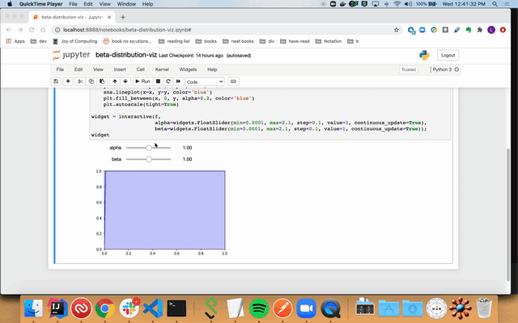

## Install
- use python3
- create a virtualenv: `sudo pip3 install virtualenv & python3 -m venv  ./venv`
- install requirements: `pip3 install -r ./requirements.txt`
- run notebook: `./venv/bin/jupyter notebook`

## Beta Distibution Visualization
- Play with different alpha and betas to see how they change the curve

## Bayesian Bandit Visualization
- Play with different number of trials, arms, and arm probabilities (ctrs)

